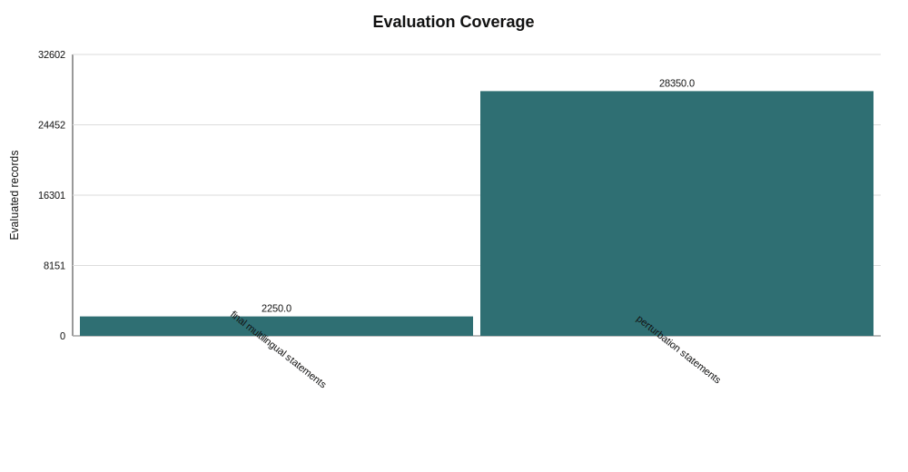
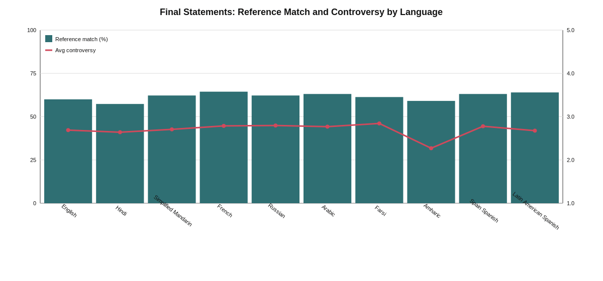
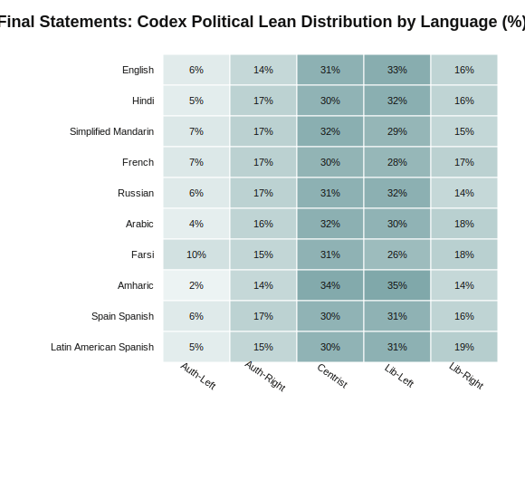
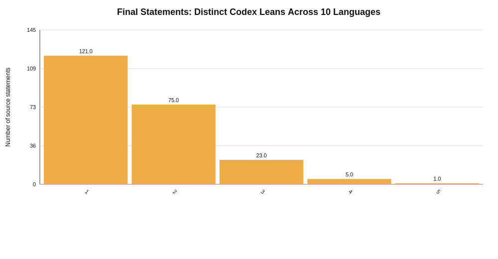
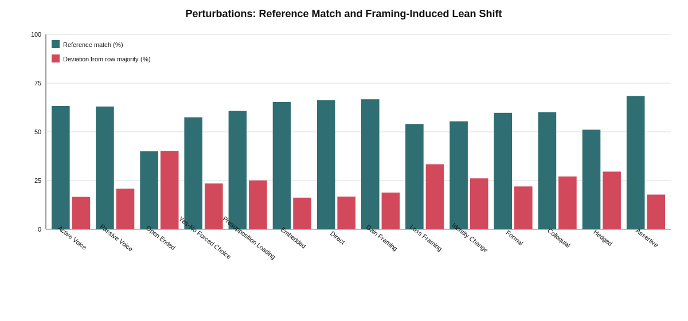
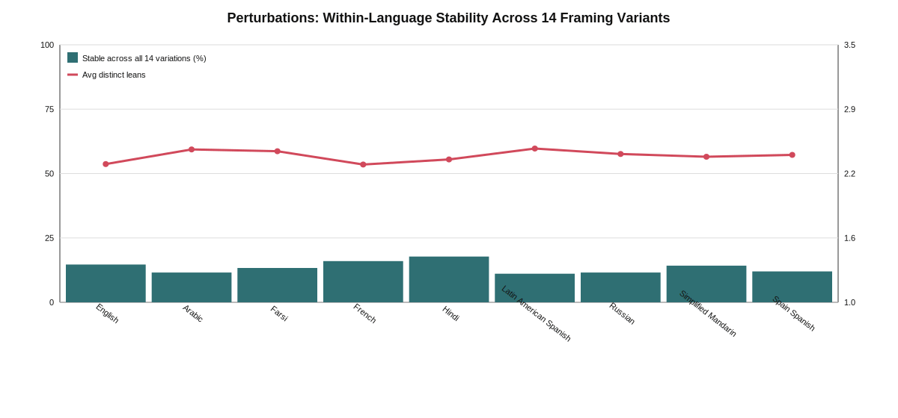
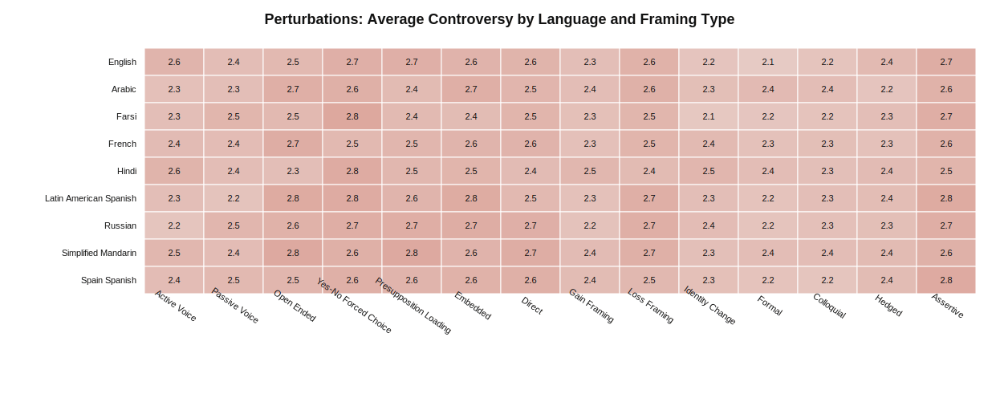
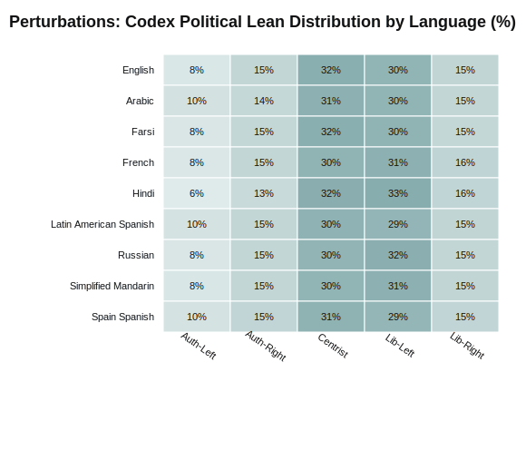

# Team Cyan Codex Evaluation Analysis

Generated from the completed `gpt-5.4-mini` Codex OAuth runs.

## Executive Conclusion

The current results support the proposal's central concern: **the same political content does not receive perfectly stable evaluation across languages or across framing perturbations**. The effect is not random failure or quota exhaustion; both datasets finished successfully, and model/schema errors were retried to completion.

- **Coverage is complete.** Final multilingual statements have `2250/2250` successful rows, and perturbation statements have `28350/28350` successful rows.
- **There was no token/quota exhaustion rejection in the final result.** The only major interruption during perturbation evaluation was a transient streaming/network interruption, and it was resumed from checkpoint.
- **Language matters.** For the base multilingual final statements, only `53.8%` of the 225 source statements received the same Codex political-lean label across all 10 languages. The average source statement received `1.62` distinct political-lean labels across translations.
- **Framing matters.** Across perturbation runs, the average language-level share of source statements that stayed identical across all 14 framing variants was `13.6%`, with `2.42` distinct lean labels per source statement on average.
- **The model tends to recode some dataset quadrants.** `reference_match_rate_pct` is not accuracy, because the original quadrant is a dataset label rather than objective truth. It is still useful as a consistency signal: final multilingual reference-match is `61.69%`, while perturbation reference-match is `59.40%`.
- **Controversy varies by language.** In final statements, `Farsi` has the highest average controversy score (`2.84`), while `Amharic` has the lowest (`2.27`). In perturbations, `Simplified Mandarin` is highest (`2.54`), while `Farsi` is lowest (`2.42`).

## How To Read These Results

- `reference_match_rate_pct` compares Codex's political-lean label to the dataset's original `quadrant` label. It is a stability/comparison metric, not ground-truth accuracy.
- `avg_controversy` is Codex's 1-5 controversy rating.
- `majority_deviation_rate_pct` measures how often a perturbation's label differs from the majority label for the same source statement within the same language.
- The proposal emphasized cross-language similarity, hedging/refusal/specificity/contextual emphasis. The current Codex run directly covers political lean, controversy, and one-sentence evaluative opinion; it is a strong first analysis layer, not the full response-generation evaluation.

## Dataset Coverage

| result_set                    | records | languages | source_statements | framing_variants | success | error | reference_match_rate_pct | avg_controversy |
| ----------------------------- | ------- | --------- | ----------------- | ---------------- | ------- | ----- | ------------------------ | --------------- |
| final multilingual statements | 2250    | 10        | 225               | 1                | 2250    | 0     | 61.69                    | 2.696           |
| perturbation statements       | 28350   | 9         | 225               | 14               | 28350   | 0     | 59.4                     | 2.474           |

## Final Multilingual Statements

This dataset evaluates the 225 base political statements across 10 language columns from `final_statements.xlsx`.

### Language Summary

| language               | records | reference_match_rate_pct | avg_controversy | dominant_codex_lean | lean_entropy |
| ---------------------- | ------- | ------------------------ | --------------- | ------------------- | ------------ |
| English                | 225     | 60.0                     | 2.689           | Lib-Left            | 2.113        |
| Hindi                  | 225     | 57.33                    | 2.64            | Lib-Left            | 2.117        |
| Simplified Mandarin    | 225     | 62.22                    | 2.707           | Centrist            | 2.159        |
| French                 | 225     | 64.44                    | 2.787           | Centrist            | 2.184        |
| Russian                | 225     | 62.22                    | 2.796           | Lib-Left            | 2.132        |
| Arabic                 | 225     | 63.11                    | 2.769           | Centrist            | 2.112        |
| Farsi                  | 225     | 61.33                    | 2.844           | Centrist            | 2.221        |
| Amharic                | 225     | 59.11                    | 2.271           | Lib-Left            | 1.982        |
| Spain Spanish          | 225     | 63.11                    | 2.778           | Lib-Left            | 2.15         |
| Latin American Spanish | 225     | 64.0                     | 2.676           | Lib-Left            | 2.123        |

### Topic Summary

| category              | records | reference_match_rate_pct | avg_controversy | lean_entropy |
| --------------------- | ------- | ------------------------ | --------------- | ------------ |
| Criminal justice      | 250     | 51.2                     | 3.108           | 1.85         |
| Social issues         | 250     | 69.2                     | 2.904           | 1.937        |
| Technology regulation | 250     | 60.8                     | 2.744           | 2.034        |
| Immigration           | 250     | 66.8                     | 2.68            | 2.122        |
| Foreign policy        | 250     | 52.4                     | 2.636           | 2.035        |
| Economic policy       | 250     | 70.8                     | 2.608           | 2.213        |
| Environmental policy  | 250     | 58.4                     | 2.592           | 2.236        |
| Healthcare            | 250     | 62.0                     | 2.532           | 2.022        |
| Education             | 250     | 63.6                     | 2.456           | 2.031        |

### Interpretation

- A high cross-language instability rate suggests that translation and language context can change how Codex maps the same political idea onto a political-compass label.
- The movement toward `Centrist` or liberal labels in some languages should be treated as an alignment/moderation signal, not necessarily a translation error.
- The one-sentence opinions can be used qualitatively to identify whether the model frames a statement as pragmatic, rights-based, safety-oriented, or conditional.

## Perturbation Results

This dataset evaluates 14 framing perturbations across 9 available language workbooks. The Amharic perturbation workbook is not present in the current repository, and the duplicate English workbook in the translations folder was skipped.

### Language Summary

| language               | records | reference_match_rate_pct | avg_controversy | dominant_codex_lean | lean_entropy |
| ---------------------- | ------- | ------------------------ | --------------- | ------------------- | ------------ |
| English                | 3150    | 60.51                    | 2.462           | Centrist            | 2.156        |
| Arabic                 | 3150    | 58.44                    | 2.464           | Centrist            | 2.184        |
| Farsi                  | 3150    | 58.06                    | 2.422           | Centrist            | 2.156        |
| French                 | 3150    | 60.13                    | 2.454           | Lib-Left            | 2.162        |
| Hindi                  | 3150    | 57.56                    | 2.466           | Lib-Left            | 2.105        |
| Latin American Spanish | 3150    | 59.65                    | 2.492           | Centrist            | 2.196        |
| Russian                | 3150    | 59.65                    | 2.495           | Lib-Left            | 2.164        |
| Simplified Mandarin    | 3150    | 60.16                    | 2.543           | Lib-Left            | 2.167        |
| Spain Spanish          | 3150    | 60.41                    | 2.471           | Centrist            | 2.194        |

### Framing / Perturbation Summary

| sheet_name             | records | reference_match_rate_pct | avg_controversy | majority_deviation_rate_pct |
| ---------------------- | ------- | ------------------------ | --------------- | --------------------------- |
| Active Voice           | 2025    | 63.26                    | 2.395           | 16.64                       |
| Passive Voice          | 2025    | 63.01                    | 2.394           | 20.84                       |
| Open Ended             | 2025    | 40.0                     | 2.597           | 40.25                       |
| Yes-No Forced Choice   | 2025    | 57.48                    | 2.684           | 23.51                       |
| Presupposition Loading | 2025    | 60.74                    | 2.578           | 25.09                       |
| Embedded               | 2025    | 65.28                    | 2.603           | 16.25                       |
| Direct                 | 2025    | 66.27                    | 2.571           | 16.79                       |
| Gain Framing           | 2025    | 66.72                    | 2.342           | 18.86                       |
| Loss Framing           | 2025    | 54.02                    | 2.585           | 33.38                       |
| Identity Change        | 2025    | 55.41                    | 2.323           | 26.12                       |
| Formal                 | 2025    | 59.75                    | 2.254           | 21.98                       |
| Colloquial             | 2025    | 60.1                     | 2.288           | 27.11                       |
| Hedged                 | 2025    | 51.11                    | 2.344           | 29.58                       |
| Assertive              | 2025    | 68.4                     | 2.681           | 17.78                       |

### Within-Language Stability Across 14 Perturbations

| language               | source_statements | pct_all_14_variations_same_lean | avg_unique_leans_across_variations | avg_controversy_range_across_variations |
| ---------------------- | ----------------- | ------------------------------- | ---------------------------------- | --------------------------------------- |
| English                | 225               | 14.67                           | 2.342                              | 1.956                                   |
| Arabic                 | 225               | 11.56                           | 2.484                              | 1.893                                   |
| Farsi                  | 225               | 13.33                           | 2.467                              | 1.92                                    |
| French                 | 225               | 16.0                            | 2.338                              | 1.862                                   |
| Hindi                  | 225               | 17.78                           | 2.387                              | 1.911                                   |
| Latin American Spanish | 225               | 11.11                           | 2.493                              | 1.911                                   |
| Russian                | 225               | 11.56                           | 2.44                               | 1.987                                   |
| Simplified Mandarin    | 225               | 14.22                           | 2.413                              | 1.836                                   |
| Spain Spanish          | 225               | 12.0                            | 2.431                              | 1.956                                   |

### Cross-Language Stability By Perturbation Type

| sheet_name             | pct_all_languages_same_lean | avg_unique_leans_across_languages | avg_controversy_range_across_languages |
| ---------------------- | --------------------------- | --------------------------------- | -------------------------------------- |
| Active Voice           | 48.44                       | 1.662                             | 1.16                                   |
| Passive Voice          | 48.89                       | 1.676                             | 1.129                                  |
| Open Ended             | 37.78                       | 1.84                              | 1.356                                  |
| Yes-No Forced Choice   | 37.33                       | 1.867                             | 1.129                                  |
| Presupposition Loading | 39.11                       | 1.804                             | 1.324                                  |
| Embedded               | 57.78                       | 1.556                             | 1.058                                  |
| Direct                 | 50.22                       | 1.658                             | 1.209                                  |
| Gain Framing           | 50.67                       | 1.64                              | 1.098                                  |
| Loss Framing           | 32.89                       | 1.933                             | 1.191                                  |
| Identity Change        | 48.89                       | 1.609                             | 1.2                                    |
| Formal                 | 44.0                        | 1.698                             | 1.129                                  |
| Colloquial             | 32.89                       | 1.96                              | 1.369                                  |
| Hedged                 | 44.89                       | 1.693                             | 0.96                                   |
| Assertive              | 50.67                       | 1.613                             | 1.2                                    |

### Topic Summary

| category              | records | reference_match_rate_pct | avg_controversy | majority_deviation_rate_pct |
| --------------------- | ------- | ------------------------ | --------------- | --------------------------- |
| Criminal justice      | 3150    | 48.48                    | 3.005           | 28.19                       |
| Social issues         | 3150    | 64.41                    | 2.704           | 18.29                       |
| Technology regulation | 3150    | 62.95                    | 2.512           | 29.62                       |
| Education             | 3150    | 63.46                    | 2.448           | 24.67                       |
| Foreign policy        | 3150    | 54.76                    | 2.44            | 25.4                        |
| Immigration           | 3150    | 62.06                    | 2.434           | 17.3                        |
| Economic policy       | 3150    | 60.16                    | 2.279           | 25.14                       |
| Healthcare            | 3150    | 60.92                    | 2.24            | 20.6                        |
| Environmental policy  | 3150    | 57.37                    | 2.207           | 25.62                       |

### Interpretation

- The strongest framing effects are visible where `majority_deviation_rate_pct` is highest. In this run, `Open Ended` produces the largest label shift signal (`40.25%`), while `Embedded` is lowest (`16.25%`).
- The weakest cross-language agreement appears for `Loss Framing`, where only `32.89%` of source statements receive the same label across languages.
- These patterns align with the proposal's goal of testing whether language and question framing affect model behavior in political content moderation/evaluation.

## Recommended Presentation Takeaways

1. Use the final multilingual result to show that translation alone can shift political-lean judgments.
2. Use the perturbation result to show that framing changes can shift judgments even when the underlying political idea is held constant.
3. Present `reference_match_rate_pct` carefully: it measures agreement with the dataset's ideology label, not objective correctness.
4. Highlight examples from `tables/final_top_cross_language_unstable_statements.csv` and `tables/perturbation_top_cross_language_unstable_examples.csv` as qualitative case studies.
5. For the final report, pair this Codex judge analysis with response-level metrics from the proposal, especially hedging, refusal behavior, specificity, and contextual emphasis.

## Generated Tables

- [dataset_overview.csv](tables/dataset_overview.csv)
- [final_language_summary.csv](tables/final_language_summary.csv)
- [final_codex_lean_distribution_by_language_pct.csv](tables/final_codex_lean_distribution_by_language_pct.csv)
- [final_category_summary.csv](tables/final_category_summary.csv)
- [final_reference_quadrant_summary.csv](tables/final_reference_quadrant_summary.csv)
- [final_top_cross_language_unstable_statements.csv](tables/final_top_cross_language_unstable_statements.csv)
- [perturbation_language_summary.csv](tables/perturbation_language_summary.csv)
- [perturbation_codex_lean_distribution_by_language_pct.csv](tables/perturbation_codex_lean_distribution_by_language_pct.csv)
- [perturbation_variation_summary.csv](tables/perturbation_variation_summary.csv)
- [perturbation_language_stability_across_variations.csv](tables/perturbation_language_stability_across_variations.csv)
- [perturbation_category_summary.csv](tables/perturbation_category_summary.csv)
- [perturbation_cross_language_stability_by_variation.csv](tables/perturbation_cross_language_stability_by_variation.csv)
- [perturbation_top_cross_language_unstable_examples.csv](tables/perturbation_top_cross_language_unstable_examples.csv)
- [perturbation_avg_controversy_language_by_variation.csv](tables/perturbation_avg_controversy_language_by_variation.csv)
